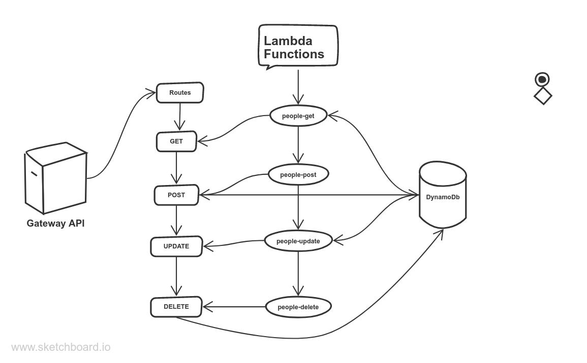

# serverless-api

## Auther: Abdallah Abu Khurma

## Root URL to API

      https://n7eribo0a9.execute-api.us-east-1.amazonaws.com

## Routes

  * GET /people

  * GET /people/{id}

  * POST /people/{id}

  * PUT /people/{id}

  * DELETE /people/{id}

## Required Inputs

    JSON => {
      "firstName": "firstName",
      "lastName": "lastName",
      "age": Number
    }

## Outputs

    body: {
      id: 994651564165484929,
      "firstName": "firstName",
      "lastName": "lastName",
      "age": Number
    }

## UML

